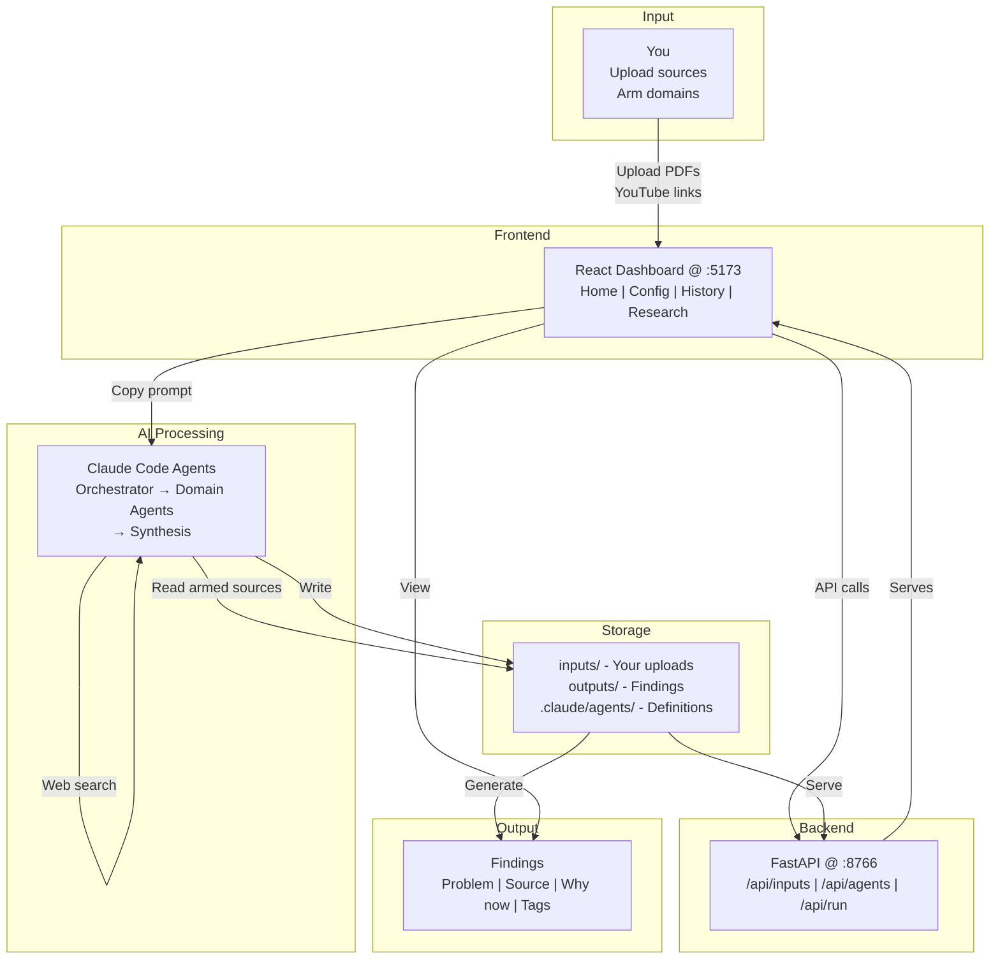

# research-scout

[](LICENSE)
[](https://python.org)
[](https://nodejs.org)
[](https://claude.ai/code)
[](https://vitejs.dev)

research-scout turns Claude Code into a private research analyst. Upload your own research materials (PDFs, YouTube transcripts, articles) to control the evidence base. Point agents at a domain (Finance, Healthcare, Energy) and they'll surface real, named problems backed by primary sources — then search the web to validate and extend. You get a structured findings summary entirely under your control.

<div align="center">

</div>

## Quickstart

```bash
git clone https://github.com/shiviancodes/research-scout
cd research-scout
```

**First time only:**
```bash
.\setup.ps1     # Windows
./setup.sh      # Mac / Linux
```

**Every time:**
```bash
.\start.ps1     # Windows
./start.sh      # Mac / Linux
```

Or with make:
```bash
make setup   # first time only
make start   # every time
make stop    # when done
```

Open the URL printed by the start script (default: **http://localhost:5173**)

## Running a research session

1. **Open the dashboard** at `http://localhost:5173`
2. **Upload research materials** (right sidebar, Sources panel):
   - Drag PDFs, markdown, text files
   - Paste YouTube links → system auto-fetches transcripts
   - See all materials in the Sources panel organized by domain
3. **Arm your materials** — toggle per-domain to control which files feed the next run
   - Marked as "primary research material on the next run"
4. **Run research** — select a domain and click "Run"
5. **Copy the prompt** shown in the dashboard
6. **Open Claude Code** terminal at project root and run: `claude`
7. **Paste and run** — agents execute automatically:
   - Domain agent(s) research against your armed sources + targeted web
   - Synthesis agent aggregates findings into a summary
8. **Refresh the History tab** to see new findings files
9. **(Optional) Edit agents** — Config page lets you adjust agent definitions, edit Standards, and restore to factory defaults


<div align="left">

</div>

## Architecture



## Customising your quality bar

`prompts/STANDARDS.md` defines what makes a finding credible:

- **Non-negotiables:** Real named problem, primary source, defensible why-now
- **Disqualifiers:** No primary source, pure trend chasing, already solved
- **Positive signals:** sa-angle, regulatory-shift, contrarian, data-moat (help readers prioritise)

Edit directly or use **Config → Standards** in the dashboard. Changes take effect on the next run.

## Key features

### Armed-Source Workflow
Upload your own research materials (PDFs, YouTube transcripts, markdown). Toggle per-domain which materials are "armed" (primary research). Run agents against materials you've curated and chosen.

### Config Page
Edit agent definitions in-browser:
- **Standards** — view quality bar reference
- **Finance, Healthcare, Energy** — edit domain agents
- **Synthesis, Orchestrator** — edit orchestration logic
- **Save** posts changes; **Restore-to-Default** pulls factory copies

### Findings Format
Standardised four-field findings (Problem, Source, Why now, Tags) make output actionable and machine-readable.

### Run Summary
Synthesis agent aggregates findings by domain and tag. No scoring, no tiers — humans decide what to investigate.

## Project structure

```
.claude/agents/             Agent definitions (orchestrator, domain, synthesis)
.claude/projects/           Agent planning docs
backend/                    FastAPI - serves outputs/ + agent/source endpoints
frontend/                   React + Vite dashboard
outputs/                    Generated artefacts (gitignored folder skeletons)
  ├─ energy/                Domain findings per run
  ├─ finance/
  ├─ healthcare/
  └─ summary/               Aggregated summaries per run
prompts/                    STANDARDS.md — quality bar
defaults/agents/            Factory copies of agent definitions (restore-to-default)
inputs/                     User-uploaded research materials per domain
  ├─ energy/
  ├─ finance/
  └─ healthcare/
docs/                       Reference materials
```

## Port configuration

| Service  | Default | Variable |
|----------|---------|----------|
| Backend  | 8766    | `BACKEND_PORT` |
| Frontend | 5173    | `FRONTEND_PORT` |

Both are set in `.env` at the project root (copy `.env.example` to get started). Vite runs with `strictPort: true` - if a port is taken it fails loudly rather than silently shifting.

## License

MIT - see [LICENSE](LICENSE).
