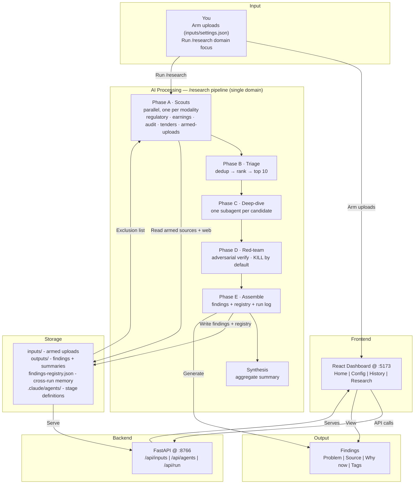

# research-scout

[](LICENSE)
[](https://python.org)
[](https://nodejs.org)
[](https://claude.ai/code)
[](https://vitejs.dev)

research-scout turns Claude Code into a private research analyst. Arm your own research materials (PDFs, YouTube transcripts, articles) to control the evidence base, then run a single-domain pipeline that scouts primary sources by modality, chases each one down, and adversarially verifies it before it survives. Point it at a domain (Finance, Healthcare, Energy) with optional focus keywords and you get a structured, primary-sourced findings summary entirely under your control — weak findings get killed, not padded.

<div align="center">

</div>

## Prerequisites
 
- Python 3.11+ and Node 18+
- **Poppler** — required for the armed-uploads **PDF** workflow. Claude
  Code reads PDFs via `pdftoppm` (part of poppler); without it, uploaded
  PDFs cannot be mined and the uploads scout reports
  `DEGRADED: PDF unreadable — poppler not installed`. Markdown/text/URL
  uploads work without it.

  | OS | Install |
  |----|---------|
  | Windows | `winget install poppler` (or `choco install poppler`), then reopen the terminal so `pdftoppm` is on `PATH` |
  | macOS | `brew install poppler` |
  | Linux | `sudo apt install poppler-utils` |

  Verify with `pdftoppm -v`.

## Quickstart

```bash
git clone https://github.com/shiviancodes/research-scout
cd research-scout
```

**First time only:**
```bash
.\setup.ps1     # Windows
./setup.sh      # Mac / Linux
```

**Every time:**
```bash
.\start.ps1     # Windows
./start.sh      # Mac / Linux
```

Or with make:
```bash
make setup   # first time only
make start   # every time
make stop    # when done
```

Open the URL printed by the start script (default: **http://localhost:5173**)

Research runs are driven by the `/research` slash command in Claude Code — **one domain per run**.

1. **(Optional) Arm uploads** — drop materials into `inputs/<domain>/` and set that domain's flag to `true` in `inputs/settings.json` (or use the dashboard Sources panel). Armed material becomes an extra scout modality for the next run, and the flag resets once consumed.
2. **Open Claude Code** at the project root and run: `claude`
3. **Run the pipeline:**
   ```
   /research energy "grid storage, municipal billing"
   ```
   - First argument is the domain — `finance` | `healthcare` | `energy`.
   - Second argument (optional) is **focus keywords** that steer scouts and triage.
   - Append `dry` for a cheap 2-scout / 2-candidate end-to-end test.
4. **Watch the stages report** — scouts (parallel, one per modality) → triage → deep-dive → red-team (kills weak candidates) → assemble → synthesis. The orchestrator prints candidate counts per modality, kills with reasons, and the survivor count.
5. **View results** — open the dashboard at `http://localhost:5173` and refresh the History tab, or read `outputs/<domain>/<YYYY-WNN>-findings.md` directly.
6. **(Optional) Edit agents** — the Config page lets you adjust the stage agent definitions, edit Standards, and restore factory defaults.


<div align="center">

</div>

## Architecture 



## Customising your quality bar

`prompts/STANDARDS.md` defines what makes a finding credible:

- **Non-negotiables:** Real named problem, primary source, defensible why-now
- **Disqualifiers:** No primary source, pure trend chasing, already solved
- **Positive signals:** sa-angle, regulatory-shift, contrarian, data-moat (help readers prioritise)

Edit directly or use **Config → Standards** in the dashboard. Changes take effect on the next run.

## Key features

### Single-domain pipeline
One run researches one domain through six stages: parallel **scouts** (one per source modality) → **triage** (dedup + rank to a shortlist) → **deep-dive** (one subagent per candidate, chasing the primary source) → **red-team** (adversarial verification) → **assemble** → **synthesis**. Driven by the `/research` slash command.

### Adversarial verification
The red-team stage independently tries to kill every candidate and **defaults to KILL when uncertain**. Thin weeks (1–2 survivors) are expected output, not failure — better empty than generic. Weak findings are dropped, never padded.

### Cross-run memory
Every candidate that reaches the red-team — survived or killed — is recorded in `outputs/findings-registry.json`. The next run builds an **exclusion list** from it so scouts don't resurface the same problems week over week.

### Focus keywords
The optional second argument to `/research` steers scouts and triage toward a theme (e.g. `"grid storage, municipal billing"`) without hard-filtering — a strong off-focus signal still beats a weak on-focus one.

### Armed-Source Workflow
Arm your own research materials (PDFs, YouTube transcripts, markdown) per domain via `inputs/settings.json` (or the dashboard Sources panel). When armed, your uploads become an extra scout modality for the next run, and the flag resets once consumed.

### Config Page
Edit agent definitions in-browser:
- **Standards** — view/edit the quality bar reference
- **Scout, Deep-dive, Red-team, Synthesis** — edit the stage agent definitions
- **Save** posts changes; **Restore-to-Default** pulls factory copies

### Findings Format & lint hook
Standardised four-field findings (Problem, Source, Why now, Tags) make output actionable and machine-readable. A `PostToolUse` hook (`scripts/lint_findings.py`) checks the format mechanically on every findings-file write.

### Run Summary
The synthesis agent aggregates findings by tag. No scoring, no tiers — humans decide what to investigate.

## Project structure

```
.claude/agents/             Stage agent definitions (scout, deep-dive, red-team, synthesis)
.claude/commands/           /research pipeline orchestrator
.claude/settings.json       PostToolUse lint hook on findings writes
backend/                    FastAPI - serves outputs/ + agent/source endpoints
frontend/                   React + Vite dashboard
scripts/                    Pipeline helpers (lint_findings, update_registry, log_run,
                            check_links, validate_domain) 
outputs/                    Generated artefacts
  ├─ energy/                Per-domain weekly findings (+ .run/ scratch dirs)
  ├─ finance/
  ├─ healthcare/
  ├─ summary/               Aggregated summaries per run
  ├─ findings-registry.json Cross-run finding memory (survivors + kills)
  └─ run-log.jsonl          Per-run telemetry
prompts/
  ├─ STANDARDS.md           Quality bar
  └─ sources/               Per-domain source packs, by scout modality
defaults/agents/            Factory copies of stage agents (restore-to-default)
inputs/                     Armed research materials per domain (+ settings.json arming)
  ├─ energy/
  ├─ finance/
  └─ healthcare/
docs/                       Reference materials
```

## Port configuration

| Service  | Default | Variable |
|----------|---------|----------|
| Backend  | 8766    | `BACKEND_PORT` |
| Frontend | 5173    | `FRONTEND_PORT` |

Both are set in `.env` at the project root (copy `.env.example` to get started). Vite runs with `strictPort: true` - if a port is taken it fails loudly rather than silently shifting.

## License

MIT - see [LICENSE](LICENSE).
